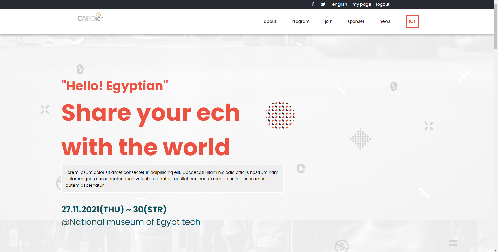

# capstone project

> This web app is about the ICT event held yearly in cairo.

> This site contans
>- Home page that includs event programs, speakers, and partners.
>- About page that includs event description and previous events.

Additional description about the project and its features.

## live demo

- project: (https://eng-mohamed-eldeeb.github.io/capstone/)

## Built With

- HTML
- CSS
- JS

## Authors

👤 **MOHAMED EL DEEB**

- GitHub: [@githubhandle](https://github.com/eng-mohamed-eldeeb)
- Twitter: [@twitterhandle](https://https://twitter.com/eldeeb_3o)
- LinkedIn: [LinkedIn](https://https://www.linkedin.com/in/mohamed-eldeeb-a69022206/)

## Show your support

Give a ⭐️ if you like this project!

## 📝 License

This project is [MIT](./MIT.md) licensed.
